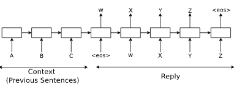

#[A Neural Conversational Model](https://arxiv.org/pdf/1506.05869v3.pdf#cite.bahdanau2014neural)

## Key ideas
* Previous approaches are closed domain
* Predict next sentence given previous sentences in a conversation
* Can be trained end-to-end -> less handcrafted rules
* Able to extract knowledge from a domain specific dataset

## Introduction
* Neural networks (NNs) can map complicated structures to other complicated structures
* Mapping sequences to sequences -> useful for natural language understanding
* Benefit from this mapping: queries -> responses

## Model
* Make use of seq2seq
  * RNN which reads input sequence 1 token at a time. Outputs 1 token at a time
  * Training: true output is given to the model, which learns by backpropagation
  * Inference: feed the predicted output token as input to predict the next output
* e.g: person A: ABC, person B: WYXZ

## Dataset
* open domain: movie dialogs from subtitles
* closed domain: IT helpdesk troubleshooting

## Experiments
* Helpdesk
  * Train a single layer of 1024 memory cells, LSTM using stochastic gradient descent with gradient clipping
  * Perplexity of 8 vs 18 for n-gram model
* Movie dataset
  * Two-layered LSTM using AdaGrad with gradient clipping, each layer of 4096 cells
